<div align="center">

# ⬡ CoreInventory

### _Enterprise-Grade Warehouse & Inventory Management System_

[](https://nextjs.org/)
[](https://expressjs.com/)
[](https://postgresql.org/)
[](https://redis.io/)
[](https://typescriptlang.org/)
[](https://tailwindcss.com/)

**A full-stack, real-time warehouse operations platform built with a premium glassmorphic UI, dark/light theme switching, and professional PDF receipt generation.**

---

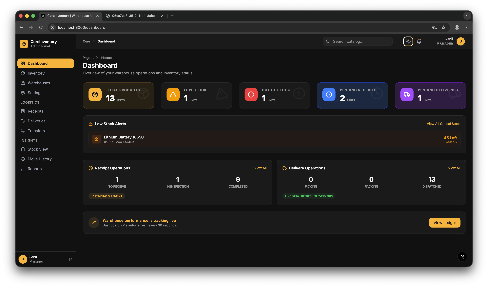

<br/><br/>

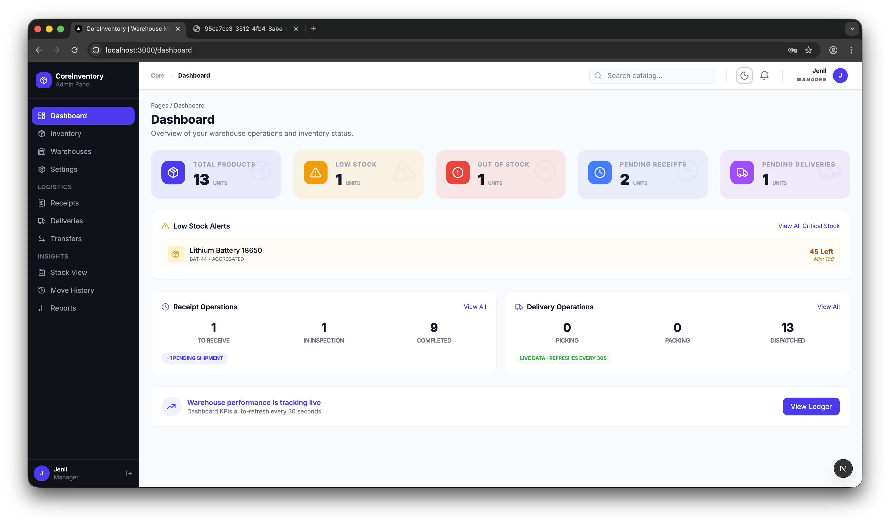

<sub>📸 Dashboard overview — switch seamlessly between Dark and Light modes</sub>

</div>

---

## 📖 Table of Contents

- [✨ Features at a Glance](#-features-at-a-glance)
- [🔑 Highlighted Features](#-highlighted-features)
  - [🌗 Dark & Light Mode](#-dark--light-mode)
  - [🖨️ Print Receipt & PDF Export](#️-print-receipt--pdf-export)
  - [📊 Real-Time KPI Dashboard](#-real-time-kpi-dashboard)
  - [📦 Stock View & Inventory Intelligence](#-stock-view--inventory-intelligence)
  - [📜 Move History & Audit Ledger](#-move-history--audit-ledger)
  - [📈 Analytics & Reports](#-analytics--reports)
- [📸 Full Application Walkthrough](#-full-application-walkthrough)
- [🏗️ Architecture](#️-architecture)
- [📦 Warehouse Operations](#-warehouse-operations)
- [🛠️ Tech Stack](#️-tech-stack)
- [🚀 Getting Started](#-getting-started)
- [📁 Project Structure](#-project-structure)
- [🔐 API Documentation](#-api-documentation)
- [🎨 Design Philosophy](#-design-philosophy)
- [🤝 Contributing](#-contributing)
- [📄 License](#-license)

---

## ✨ Features at a Glance

| Feature | Description |
|---|---|
| 📊 **Real-Time KPI Dashboard** | Animated counters, status-aware cards (healthy/warning/critical), and live stock alerts |
| 🖨️ **Professional PDF Receipts** | One-click print-ready receipts with company branding, signatures block, and routing details |
| 🌗 **Dark / Light Mode** | Seamless theme switching with persistence — your preference is remembered across sessions |
| 📦 **Full Warehouse Operations** | Create Receipts, Deliveries, Transfers, and Adjustments with a guided multi-step workflow |
| 🔍 **Smart Stock Alerts** | Automatic detection of low-stock and out-of-stock items with direct review links |
| 🔄 **Operation Lifecycle** | Draft → Waiting → Ready → Done / Canceled — full status tracking with validation gates |
| 🏭 **Multi-Warehouse Support** | Manage multiple warehouses and storage locations with zone-level granularity |
| 📜 **Move History Ledger** | Complete audit trail of every stock movement with timestamps and user attribution |
| 📈 **Analytics & Reports** | Live summary of inventory movement, operational status, and recent ledger entries |
| 🟢 **Live Backend Status** | Real-time connectivity monitoring with auto-reconnect and manual ping |
| 🎨 **Glassmorphic Premium UI** | Modern frosted-glass design with subtle gradients, glow effects, and micro-animations |
| 📱 **Fully Responsive** | Optimized for desktop, tablet, and mobile with adaptive navigation |
| 🔐 **JWT Authentication** | Secure login with access/refresh token rotation and role-based access |
| ⚙️ **Settings & Profile** | User profile management, role & access info, password reset, and notification preferences |

---

## 🔑 Highlighted Features

### 🌗 Dark & Light Mode

> **⭐ Highlight Feature** — A premium dual-theme system with seamless switching.

CoreInventory ships with a **premium dual-theme system** powered by `next-themes`. Toggle with a single click on the **☀️ / 🌙 icon** in the header — your preference is persisted across sessions.

<div align="center">

<table>
<tr>
<td align="center"><strong>🌑 Dark Mode</strong></td>
<td align="center"><strong>☀️ Light Mode</strong></td>
</tr>
<tr>
<td></td>
<td></td>
</tr>
</table>

<sub>↑ The same powerful dashboard rendered in both themes — notice the glassmorphic KPI cards, low-stock alerts, and live operation counters</sub>

</div>

| | Dark Mode ⬡ | Light Mode ☀️ |
|---|---|---|
| **Background** | Deep OLED blacks (`oklch(10%)`) | Soft paper white (`oklch(98%)`) |
| **Surfaces** | Frosted glass with subtle borders | Clean white cards with light borders |
| **Text** | High contrast warm white | Rich dark grey for readability |
| **Accent** | Warm amber/gold (`oklch(72% 70)`) | Same amber — consistent brand |
| **Persistence** | ✅ Saved to localStorage | ✅ Survives refresh & navigation |

---

### 🖨️ Print Receipt & PDF Export

> **⭐ Highlight Feature** — One of the standout capabilities of CoreInventory.

The system generates **professional, print-ready receipt documents** for every warehouse operation — receipts, deliveries, transfers, adjustments, and even full stock inventory reports.

<div align="center">

<table>
<tr>
<td align="center"><strong>📄 Goods Receipt Note</strong></td>
<td align="center"><strong>📊 Inventory Adjustment Report</strong></td>
</tr>
<tr>
<td>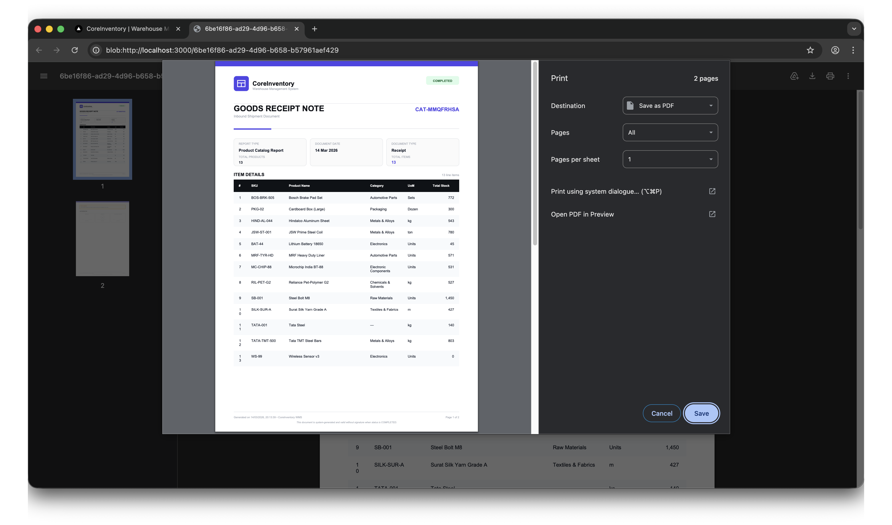</td>
<td>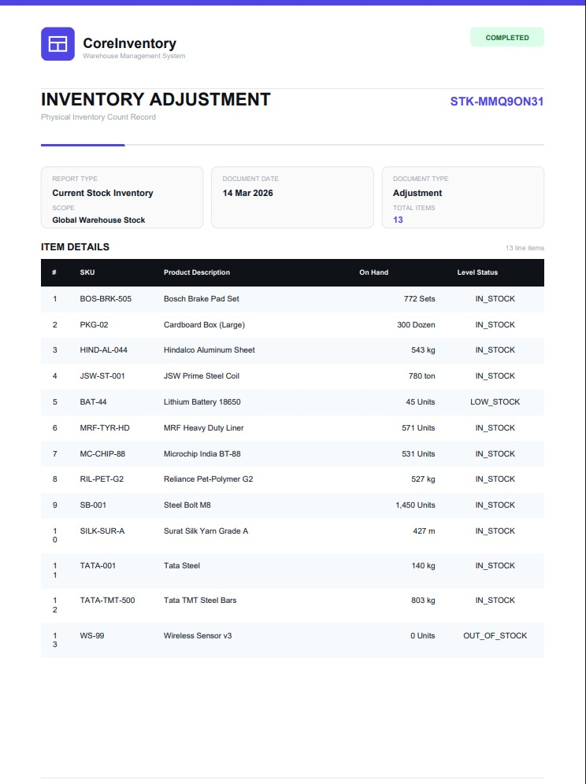</td>
</tr>
</table>

<sub>↑ Left: Goods Receipt Note with product catalog • Right: Inventory Adjustment with stock levels & status indicators</sub>

</div>

#### What Makes It Special:

| Aspect | Detail |
|---|---|
| 🏢 **Company Branding** | Includes the CoreInventory logo and "Warehouse Management System" tagline |
| 📋 **Operation Details** | Date, status, created by, and reference number — all clearly formatted |
| 🗺️ **Routing Section** | Shows **Source** and **Destination** locations with human-readable names |
| 📦 **Product Lines Table** | Clean table with product name, SKU, category, UoM, quantities, and stock status |
| 📝 **Notes Section** | Any remarks or internal notes are rendered in a styled block |
| ✍️ **Signature Blocks** | Three signature lines: _Prepared By_, _Verified / Authorized By_, _Carrier / Receiver_ |
| 🕐 **Timestamp Footer** | Auto-generated date/time stamp showing when the document was produced |
| 🖨️ **Clean Print Output** | Sidebar, header, and navigation are automatically hidden — only the receipt prints |
| 📊 **Stock Reports** | Dedicated button to print full stock inventory with current levels and status per item |

#### How It Works:

```
1. Navigate to any operation detail page (e.g., /operations/[id])
2. Click the "Print PDF" button in the action bar
3. The browser print dialog opens with a clean, white receipt
4. Save as PDF or send directly to printer
```

> 💡 **Bonus:** The "Print Catalog" / "Print Stock Report" / "Print Ledger" buttons on the Products, Stock View, and Reports pages generate comprehensive inventory reports with all items, their stock levels, and status indicators — perfect for board meetings and audits.

---

### 📊 Real-Time KPI Dashboard

The dashboard provides an **at-a-glance operational overview** with animated KPI cards and live data refresh.

<div align="center">
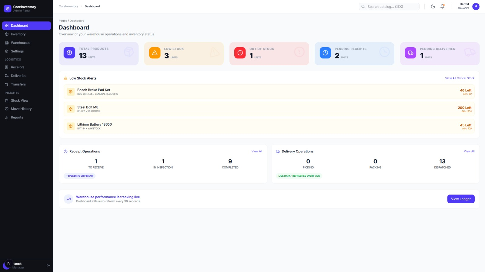

> _Complete dashboard with KPI cards, low stock alerts, receipt/delivery operation counters, and live tracking status._
</div>

| Card | What It Shows | Status Indicator |
|---|---|---|
| **Total Products** | Sum of all products currently in catalog | 🟢 Healthy |
| **Low Stock** | Products below minimum threshold | 🟡 Warning (pulse animation) |
| **Out of Stock** | Products with zero quantity | 🔴 Critical (urgent pulse) |
| **Pending Receipts** | Incoming goods awaiting processing | 🟢 Normal |
| **Pending Deliveries** | Outbound orders to fulfill | 🟢 Normal |

#### Additional Dashboard Sections:

- **⚠️ Low Stock Alerts** — Products that need immediate review with remaining quantity and min threshold
- **📥 Receipt Operations** — Live counters for To Receive / In Inspection / Completed with pending shipment badges
- **📤 Delivery Operations** — Picking / Packing / Dispatched counters with real-time refresh indicator
- **📡 Live Tracking** — "Warehouse performance is tracking live" banner with auto-refresh every 30 seconds
- **📋 View Ledger** — Quick access to the full stock movement audit trail

---

### 📦 Stock View & Inventory Intelligence

A powerful **real-time stock visibility** page showing every product with warehouse-level breakdown.

<div align="center">

<table>
<tr>
<td align="center"><strong>📊 Stock View (Dark Mode)</strong></td>
<td align="center"><strong>📊 Stock View (Light Mode)</strong></td>
</tr>
<tr>
<td>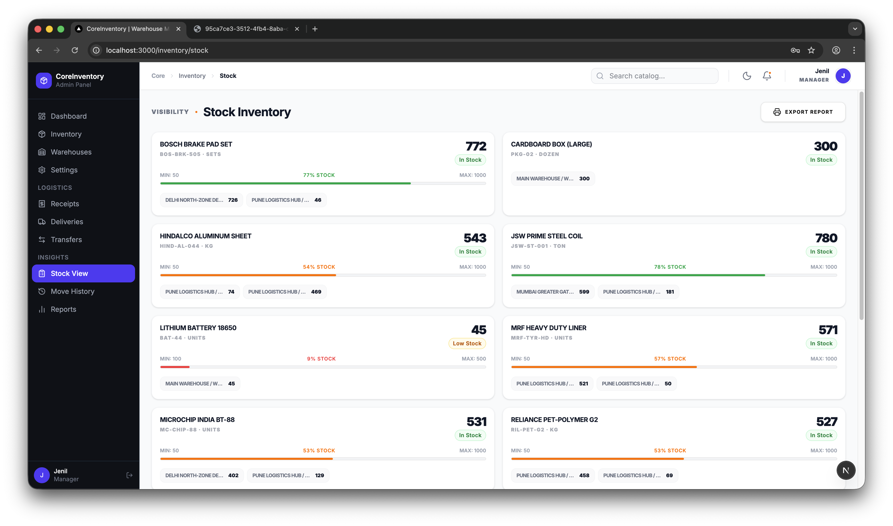</td>
<td>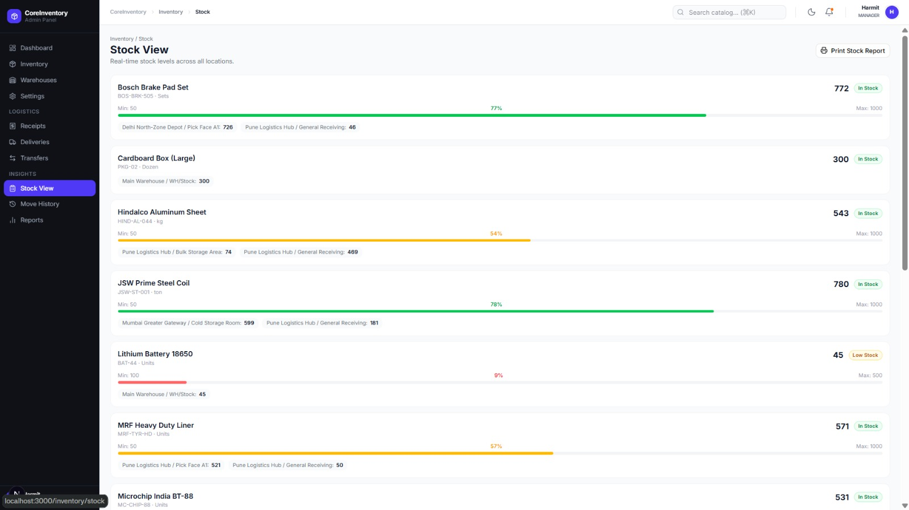</td>
</tr>
</table>

<sub>↑ Each product card shows: name, SKU, UoM, stock level, min/max thresholds, percentage bar, warehouse distribution, and export report capability</sub>

</div>

#### Key Capabilities:

| Feature | Detail |
|---|---|
| 📊 **Stock Level Bars** | Color-coded progress bars (green, amber, red) showing min/max threshold utilization |
| 🏭 **Warehouse Breakdown** | Per-location stock quantities (e.g., "Delhi North-Zone: 726 · Pune Hub: 46") |
| 🏷️ **Status Badges** | In Stock / Low Stock / Out of Stock with instant visual identification |
| 📤 **Export Report** | One-click "Print Stock Report" generates a comprehensive PDF |
| 📈 **Percentage Indicators** | Shows exact stock % (e.g., "77% STOCK") for quick assessment |

---

### 📜 Move History & Audit Ledger

A complete, **immutable audit trail** of every stock movement across all operations.

<div align="center">
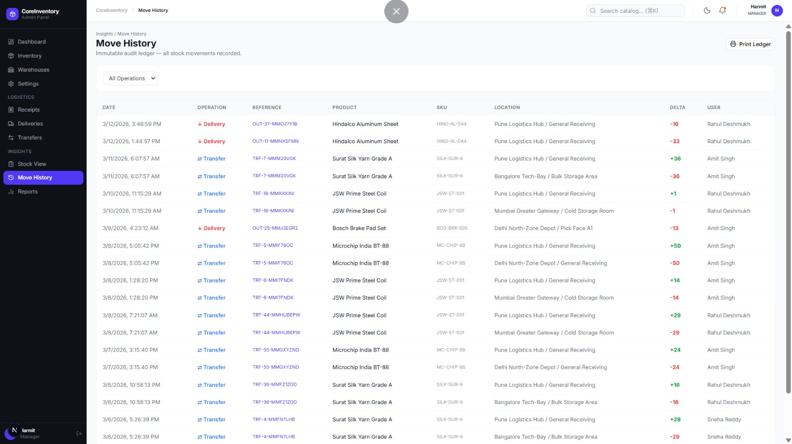

> _Full audit ledger showing Date, Operation Type (color-coded: Delivery ↓ red, Transfer ⇄ blue), Reference, Product, SKU, Location, Delta (+/-), and User attribution._
</div>

#### What Makes It Powerful:

- **🔴 Red deltas** for stock decreases (deliveries, outbound transfers)
- **🟢 Green deltas** for stock increases (receipts, inbound transfers)
- **🔗 Clickable references** — jump directly to the related operation detail
- **👤 User attribution** — track who made every movement
- **🔍 Filterable** — "All Operations" dropdown to filter by Receipt, Delivery, Transfer
- **🖨️ Print Ledger** — Export the full audit trail as a PDF document

---

### 📈 Analytics & Reports

A dedicated **reporting dashboard** with KPI summary, recent movement summary, and export capabilities.

<div align="center">
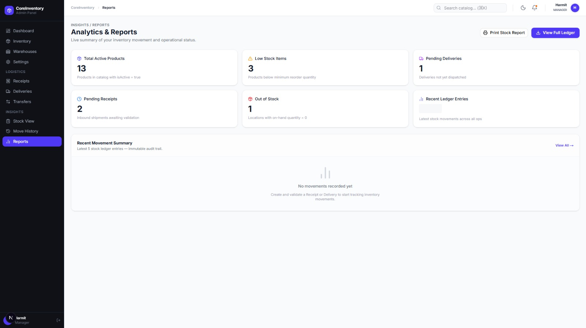

> _Reports page with Total Active Products, Low Stock Items, Pending Deliveries, Pending Receipts, Out of Stock, Recent Ledger Entries, and Recent Movement Summary._
</div>

#### Report Dashboard Cards:

| Card | Description |
|---|---|
| **Total Active Products** | Products with `isActive = true` |
| **Low Stock Items** | Products below minimum reorder quantity |
| **Pending Deliveries** | Deliveries not yet dispatched |
| **Pending Receipts** | Inbound shipments awaiting validation |
| **Out of Stock** | Locations with on-hand quantity = 0 |
| **Recent Ledger Entries** | Latest stock movements across all ops |

Plus **"Print Stock Report"** and **"View Full Ledger"** quick action buttons.

---

## 📸 Full Application Walkthrough

Below is a complete visual walkthrough of every major screen in CoreInventory, following the natural user flow:

<div align="center">

### 1️⃣ Login & Authentication
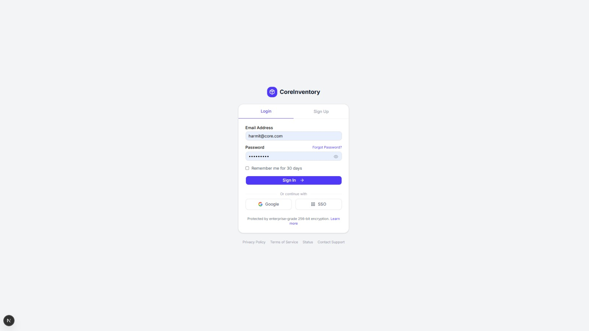

> _Clean login page with email/password authentication, "Remember me" option, Google & SSO sign-in buttons, and enterprise-grade 256-bit encryption notice._

---

### 2️⃣ Dashboard — Dark Mode


> _Glassmorphic KPI cards with animated counters, low-stock alerts, receipt/delivery operation counters, and live warehouse tracking._

---

### 3️⃣ Dashboard — Light Mode


> _Same powerful dashboard in a clean, bright white theme — crystal clear readability._

---

### 4️⃣ Product Catalog (Inventory)
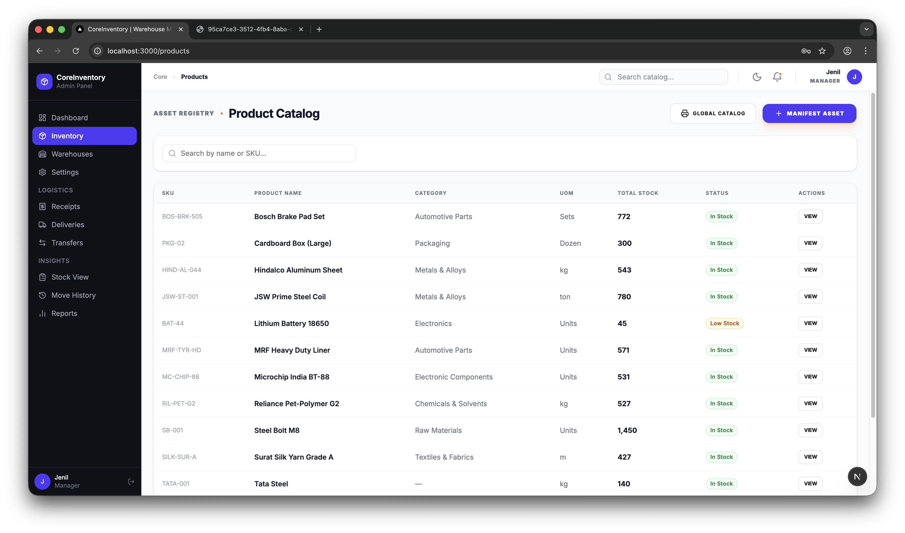

> _Full product catalog with SKU, name, category, UoM, total stock, status badges (In Stock / Low Stock), search, and one-click "Manifest Asset" creation._

---

### 5️⃣ Product Catalog (Light Mode — Full View)
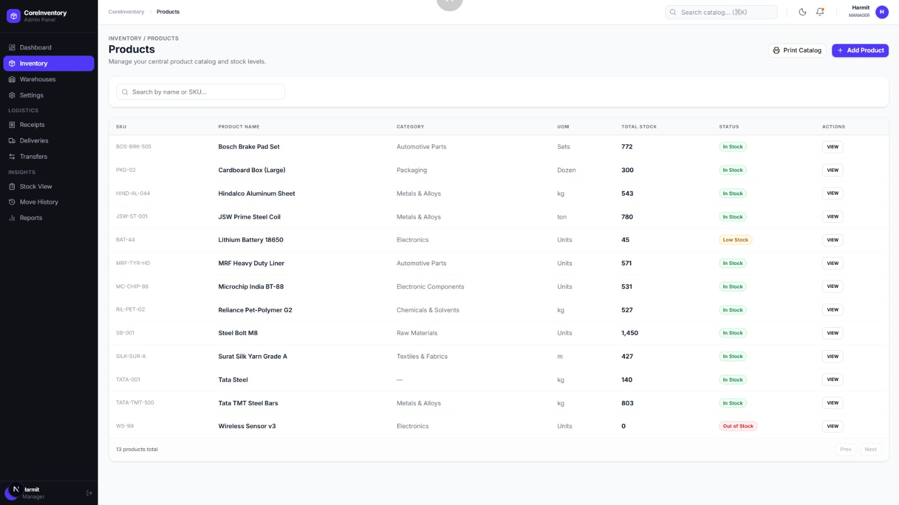

> _Products page in light theme showing all 13 products with "Print Catalog" and "+ Add Product" action buttons._

---

### 6️⃣ Stock View — Dark Mode


> _Grid-based stock cards with min/max thresholds, color-coded progress bars, and multi-warehouse quantity breakdown._

---

### 7️⃣ Stock View — Light Mode


> _Detailed stock analysis with percentage indicators and warehouse-level distribution per product._

---

### 8️⃣ Receipts (Incoming Goods)
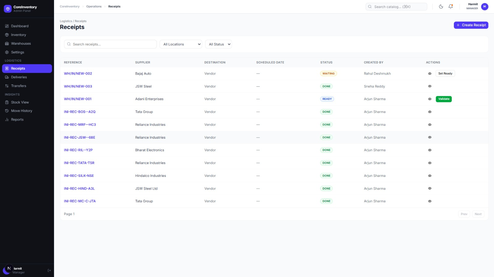

> _Receipts list with reference links, supplier, destination, status pills (WAITING / DONE / READY), creator, and action buttons (Set Ready / Validate)._

---

### 9️⃣ Deliveries (Outbound Orders)
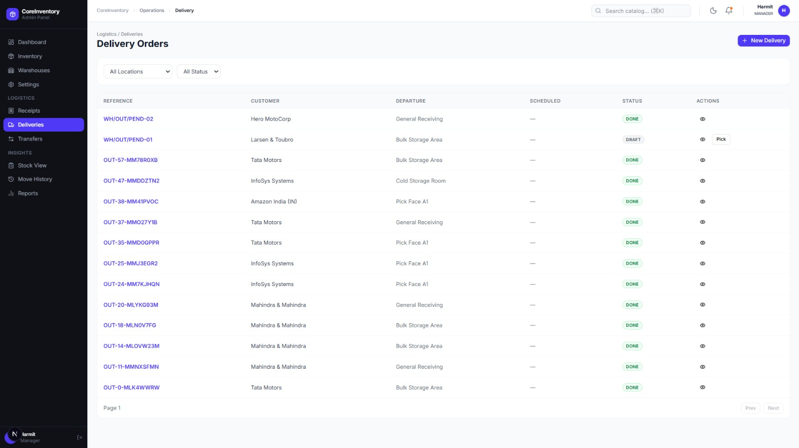

> _Delivery orders with customer name, departure location, status tracking (DONE / DRAFT), and "Pick" action for draft deliveries._

---

### 🔟 Internal Transfers
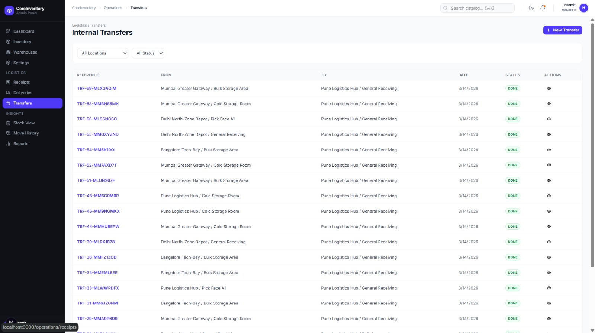

> _Transfer log showing source → destination locations, date, status, and eye icon for detail view._

---

### 1️⃣1️⃣ Move History (Audit Ledger)


> _Immutable ledger with color-coded deltas, operation type labels, product tracking, and user attribution._

---

### 1️⃣2️⃣ Analytics & Reports


> _Operational reporting dashboard with KPI summary cards, recent movement summary, and export actions._

---

### 1️⃣3️⃣ Warehouse Settings
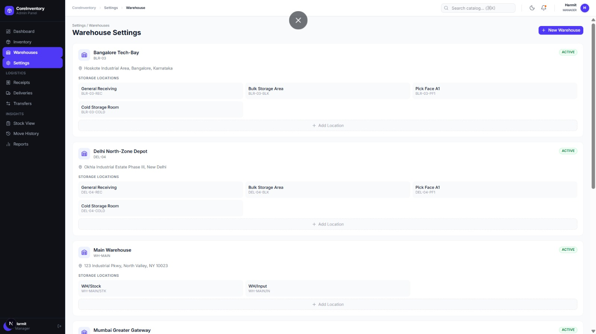

> _Multi-warehouse management with location zones: General Receiving, Bulk Storage Area, Pick Face A1, Cold Storage Room — add new locations and warehouses._

---

### 1️⃣4️⃣ General Settings & Profile
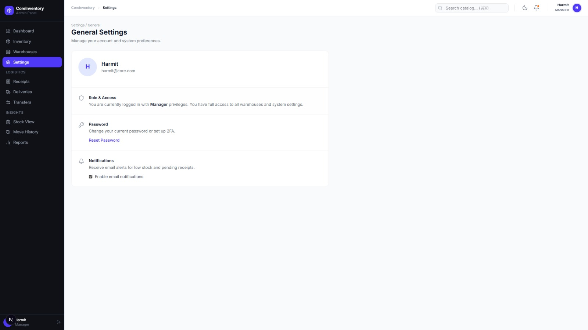

> _User profile with role & access info (Manager privileges), password management, 2FA setup, and notification preferences._

---

### 1️⃣5️⃣ Print — Goods Receipt Note


> _Professional print template showing the browser print dialog with CoreInventory branded Goods Receipt Note, product catalog table, and "Save as PDF" option._

---

### 1️⃣6️⃣ Print — Inventory Adjustment Report


> _Inventory Adjustment document with SKU, product description, on-hand quantities, UoM, and stock level status indicators per item._

</div>

---

## 🏗️ Architecture

```
┌──────────────────────────────────────────────────────────────────┐
│                        CLIENT (Browser)                          │
│  ┌────────────────────────────────────────────────────────────┐  │
│  │              Next.js 16 (App Router + RSC)                 │  │
│  │  ┌──────────┐ ┌──────────┐ ┌──────────┐ ┌──────────────┐   │  │
│  │  │Dashboard │ │Products  │ │Operations│ │  Settings    │   │  │
│  │  │  Page    │ │  CRUD    │ │ Workflow │ │  & Profile   │   │  │
│  │  └────┬─────┘ └────┬─────┘ └────┬─────┘ └──────┬───────┘   │  │
│  │       │            │            │              │           │  │
│  │  ┌────┴────────────┴────────────┴──────────────┴────────┐  │  │
│  │  │           React Query + Zustand State                │  │  │
│  │  │      (Auth, Backend Status, UI, Theme)               │  │  │
│  │  └─────────────────────┬────────────────────────────────┘  │  │
│  └────────────────────────┼───────────────────────────────────┘  │
└───────────────────────────┼──────────────────────────────────────┘
                            │  REST API (Axios)
                            ▼
┌──────────────────────────────────────────────────────────────────┐
│                      SERVER (Express 5)                          │
│  ┌─────────┐ ┌──────────┐ ┌───────────┐ ┌───────────────────┐    │
│  │  Auth   │ │ Products │ │Operations │ │  Stock Ledger     │    │
│  │  Module │ │  Module  │ │  Module   │ │    Module         │    │
│  └────┬────┘ └────┬─────┘ └─────┬─────┘ └────────┬──────────┘    │
│       └───────────┴─────────────┴────────────────┘               │
│                           │                                      │
│              ┌────────────┼────────────┐                         │
│              ▼            ▼            ▼                         │
│        ┌──────────┐ ┌──────────┐ ┌──────────┐                    │
│        │PostgreSQL│ │  Redis   │ │  Winston │                    │
│        │   15     │ │    7     │ │  Logger  │                    │
│        └──────────┘ └──────────┘ └──────────┘                    │
└──────────────────────────────────────────────────────────────────┘
```

---

## 📦 Warehouse Operations

CoreInventory supports **4 types of inventory operations**, each with a complete lifecycle:

### Operation Types

| Type | Icon | Purpose | Screenshot |
|---|---|---|---|
| **Receipt** | 📥 | Receive incoming stock from external suppliers into a warehouse location | See [Receipts List](#8️⃣-receipts-incoming-goods) |
| **Delivery** | 📤 | Ship outbound stock to external customers from a warehouse location | See [Deliveries List](#9️⃣-deliveries-outbound-orders) |
| **Transfer** | 🔄 | Move stock between internal warehouse locations | See [Transfers List](#🔟-internal-transfers) |
| **Adjustment** | ✏️ | Correct inventory discrepancies (count corrections, damage write-offs) | — |

### Operation Lifecycle

```
  ┌─────────┐     ┌─────────┐     ┌─────────┐     ┌─────────┐
  │  DRAFT  │ ──▶ │ WAITING │ ──▶ │  READY  │ ──▶ │  DONE   │
  └─────────┘     └─────────┘     └─────────┘     └─────────┘
       │                                                 
       │               ┌───────────┐                     
       └─────────────▶ │ CANCELED  │                     
                       └───────────┘                     
```

Each transition is **permission-gated** and updates the stock ledger atomically. Actions like "Set Ready", "Validate", and "Pick" appear contextually based on the current status.

---

## 🛠️ Tech Stack

### Frontend
| Technology | Purpose |
|---|---|
| **Next.js 16** | React framework with App Router and Server Components |
| **React 19** | UI library with latest concurrent features |
| **Tailwind CSS 4** | Utility-first CSS with `@theme` design tokens |
| **Zustand** | Lightweight state management (auth, UI, backend status) |
| **React Query v5** | Server state management with caching and invalidation |
| **Lucide React** | Beautiful, consistent icon library |
| **next-themes** | Dark/Light mode with SSR compatibility |
| **date-fns** | Lightweight date formatting utilities |
| **jsPDF** | Client-side PDF generation for receipts and reports |

### Backend
| Technology | Purpose |
|---|---|
| **Express 5** | HTTP server with middleware pipeline |
| **PostgreSQL 15** | Primary relational database |
| **Redis 7** | Caching and session storage |
| **Knex.js** | SQL query builder and migration runner |
| **JWT** | Authentication with access + refresh tokens |
| **bcrypt** | Secure password hashing |
| **Zod** | Runtime input validation |
| **Winston** | Structured logging |
| **Helmet** | Security headers middleware |

### Infrastructure
| Technology | Purpose |
|---|---|
| **Docker Compose** | Container orchestration for DB + Redis |
| **ts-node-dev** | Hot-reload development server |

---

## 🚀 Getting Started

### Prerequisites

- **Node.js** ≥ 18.x
- **Docker** & Docker Compose (for PostgreSQL + Redis)
- **npm** or **pnpm**

### 1️⃣ Clone the Repository

```bash
git clone https://github.com/JenilRevaliya/odoo_ims.git
cd odoo_ims
```

### 2️⃣ Start Infrastructure

```bash
docker-compose up -d
```

This starts:
- 🐘 **PostgreSQL** on port `15432`
- 🔴 **Redis** on port `6379`

### 3️⃣ Setup Backend

```bash
cd backend
cp .env.example .env
npm install
npm run dev
```

The API server starts on **http://localhost:3001**

### 4️⃣ Setup Frontend

```bash
cd frontend
npm install
```

Create `.env.local`:
```env
NEXT_PUBLIC_API_URL=http://localhost:3001/v1
NEXT_PUBLIC_USE_MOCKS=false
```

```bash
npm run dev
```

The app opens on **http://localhost:3000** 🎉

### 5️⃣ Run Database Migrations

```bash
cd backend
npx knex migrate:latest
```

---

## 📁 Project Structure

```
CoreInventory/
│
├── 📂 backend/                    # Express API Server
│   ├── 📂 src/
│   │   ├── 📂 modules/
│   │   │   ├── 📂 auth/          # Login, Register, Refresh, Forgot Password
│   │   │   ├── 📂 products/      # CRUD + Stock Queries
│   │   │   ├── 📂 operations/    # Receipts, Deliveries, Transfers, Adjustments
│   │   │   ├── 📂 warehouses/    # Warehouse & Location Management
│   │   │   ├── 📂 dashboard/     # KPI Aggregation Queries
│   │   │   ├── 📂 stock-ledger/  # Audit Trail & Move History
│   │   │   └── 📂 profile/       # User Profile Management
│   │   ├── app.ts                # Express App Setup
│   │   └── server.ts             # Entry Point
│   ├── 📂 migrations/            # Knex Database Migrations
│   └── 📂 tests/                 # Jest Test Suite
│
├── 📂 frontend/                   # Next.js Client Application
│   ├── 📂 src/
│   │   ├── 📂 app/
│   │   │   ├── 📂 (auth)/       # Login, Signup, Forgot Password Pages
│   │   │   ├── 📂 (dashboard)/  # Protected Dashboard Routes
│   │   │   ├── globals.css       # Design Tokens + Theme Variables
│   │   │   └── layout.tsx        # Root Layout with Fonts
│   │   ├── 📂 components/
│   │   │   ├── 📂 layout/       # Sidebar, Header, BottomNav, AuthGuard
│   │   │   └── 📂 ui/           # KPICard, Toast, Skeleton, ThemeToggle, Receipt
│   │   ├── 📂 hooks/            # React Query Hooks (useProducts, useOperations...)
│   │   ├── 📂 lib/              # Axios Instance, Mock Data
│   │   ├── 📂 providers/        # QueryClient, Theme, Auth Providers
│   │   ├── 📂 store/            # Zustand Stores (auth, backend, ui, toast)
│   │   └── 📂 types/            # TypeScript Interfaces
│   └── 📂 public/               # Static Assets
│
├── 📂 docs/                      # Documentation & Screenshots
│   └── 📂 screenshots/          # App Screenshots for README
│
├── 📂 shared/                    # Shared Constants & Types
├── docker-compose.yml            # Infrastructure Setup
└── README.md                     # ← You are here!
```

---

## 🔐 API Documentation

### Authentication

| Method | Endpoint | Description |
|---|---|---|
| `POST` | `/v1/auth/register` | Create new user account |
| `POST` | `/v1/auth/login` | Login with email + password |
| `POST` | `/v1/auth/refresh` | Refresh access token |
| `POST` | `/v1/auth/forgot-password` | Request password reset |

### Products

| Method | Endpoint | Description |
|---|---|---|
| `GET` | `/v1/products` | List all products with stock info |
| `GET` | `/v1/products/:id` | Get single product with location breakdown |
| `POST` | `/v1/products` | Create new product |
| `PATCH` | `/v1/products/:id` | Update product details |
| `DELETE` | `/v1/products/:id` | Delete product |

### Operations

| Method | Endpoint | Description |
|---|---|---|
| `GET` | `/v1/operations` | List operations with filters |
| `GET` | `/v1/operations/:id` | Get operation with product lines |
| `POST` | `/v1/operations` | Create new operation (draft) |
| `PATCH` | `/v1/operations/:id` | Update operation details |
| `POST` | `/v1/operations/:id/submit` | Submit for approval |
| `POST` | `/v1/operations/:id/ready` | Mark as ready |
| `POST` | `/v1/operations/:id/validate` | Validate & execute (updates stock) |
| `POST` | `/v1/operations/:id/cancel` | Cancel operation |

### Warehouses

| Method | Endpoint | Description |
|---|---|---|
| `GET` | `/v1/warehouses` | List all warehouses |
| `POST` | `/v1/warehouses` | Create warehouse |
| `GET` | `/v1/warehouses/:id/locations` | List locations in warehouse |
| `POST` | `/v1/warehouses/:id/locations` | Create location |

### Dashboard & Ledger

| Method | Endpoint | Description |
|---|---|---|
| `GET` | `/v1/dashboard/kpis` | Get KPI summary data |
| `GET` | `/v1/stock-ledger` | Get stock movement history |
| `GET` | `/v1/health` | Health check endpoint |

---

## 🎨 Design Philosophy

CoreInventory follows a **premium, enterprise-grade design language**:

- **🪟 Glassmorphism** — Frosted-glass surfaces with `backdrop-blur` and subtle borders
- **✨ Micro-animations** — Counter animations on KPI values, shimmer effects on hover, smooth transitions
- **🎯 Status-driven UI** — Colors react to data state (green = healthy, amber = warning, red = critical)
- **📐 Fluid Typography** — `clamp()` based sizing that scales perfectly from mobile to 4K
- **🖋️ Premium Typography** — DM Mono for headings, IBM Plex Sans for body, IBM Plex Mono for code
- **🧱 Design Tokens** — All colors, spacing, and radii defined as CSS custom properties for consistency
- **🌗 Theme System** — `next-themes` with oklch-based color palettes for perceptually uniform dark/light modes
- **🖨️ Print-First Documents** — Dedicated CSS print styles that strip all UI chrome for clean PDF output

---

## 🤝 Contributing

1. Fork the repository
2. Create your feature branch: `git checkout -b feature/amazing-feature`
3. Commit your changes: `git commit -m 'Add amazing feature'`
4. Push to the branch: `git push origin feature/amazing-feature`
5. Open a Pull Request

---

## 📄 License

This project is built as part of **Odoo x Indus Hackathon**. All rights reserved.

---

<div align="center">

### Built with ❤️ by **Jenil Soni** · **Harmit Kalal** · **Aarth Patel**

_For **Odoo x Indus Hackathon**_

_CoreInventory — Where precision meets elegance in warehouse management._

⬡

</div>
